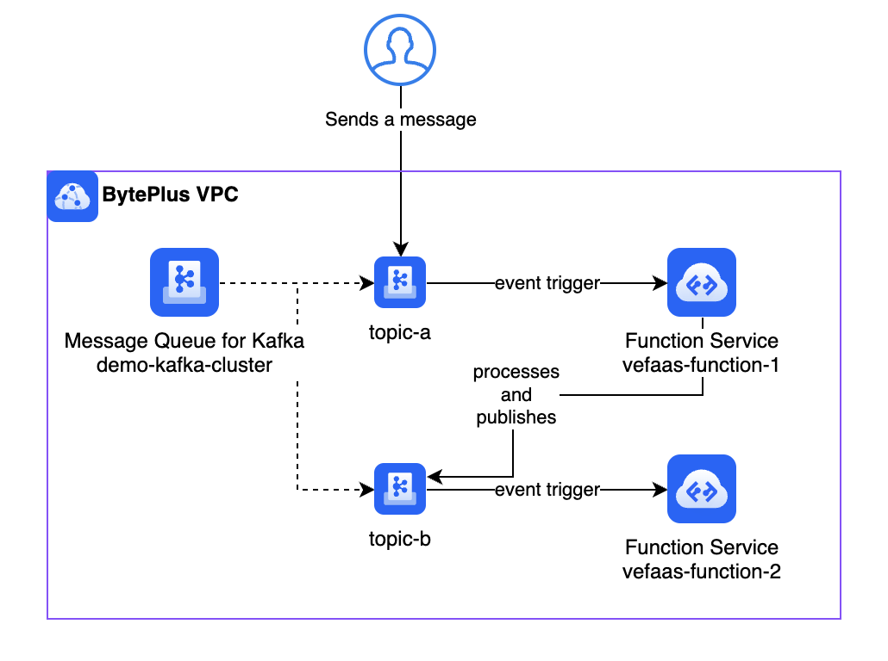

# BytePlus Serverless Kafka Processing Demo

This repository contains sample code for a serverless event processing pipeline using BytePlus Function Service and Message Queue for Kafka.

## Architecture

- Messages sent to Kafka `topic-a` trigger `vefaas-function-1`.
- `vefaas-function-1` processes the message (adds timestamp) and publishes to `topic-b`.
- Messages on `topic-b` trigger `vefaas-function-2` which logs the message.

## Repository Contents

- `function-1/` - Source code for the first function (processes and forwards messages)
- `function-2/` - Source code for the second function (logs messages)
- `deployment-guide.pdf` - Comprehensive step-by-step deployment instructions

## Prerequisites

- BytePlus account with access to Function Service and Message Queue for Kafka
- VPC network for secure communication between services

## Quick Start

1. Create a Kafka cluster on BytePlus with two topics: `topic-a` and `topic-b`
2. Create two SASL users: `function-1-user` and `function-2-user`
3. Deploy two Node.js 20.x functions using the code in this repository
4. Configure Kafka triggers to connect the functions to their respective topics
5. Send a test message to `topic-a` and observe the processing flow

## Environment Variables

**vefaas-function-1:**
- `KAFKA_BOOTSTRAP_SERVER`: SASL_PLAINTEXT endpoint (e.g., `kafka-instance.kafka.ibytepluses.com:9093`)
- `KAFKA_USERNAME`: Kafka username (e.g., `function-1-user`)
- `KAFKA_PASSWORD`: Kafka password

## Detailed Setup

For complete deployment instructions, refer to the [deployment guide](./deployment-guide.pdf) included in this repository.